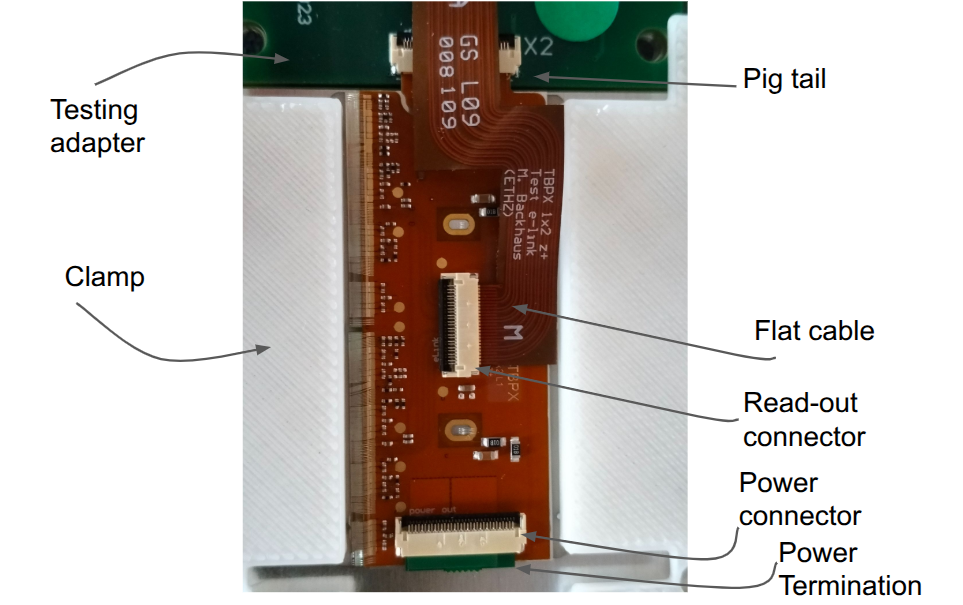
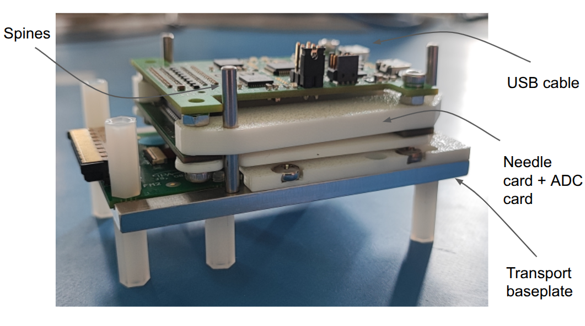
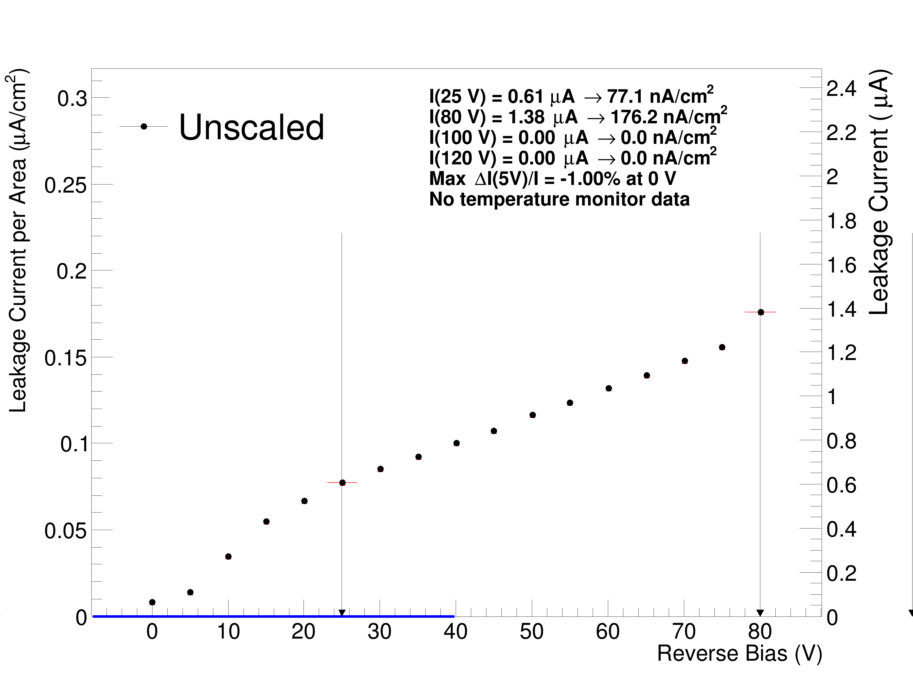

# **Preliminary Operations**

Software:

* [Dirigent](https://gitlab.cern.ch/cms_tk_ph2/dirigent)
    * A software wrapper, wrapping together Ph2_ACF (DAQ software) and icicle (software for PS controlling)
* [Ph2_ACF](https://gitlab.cern.ch/cms_tk_ph2/ph2_acf)
    * DAQ software has to be installed independently, look for the latest tagged version for IT 
* [POWDER](https://gitlab.cern.ch/cms_tk_ph2/power_supply)
    * Power supply libraries that is needed only to work with the CAEN LV
* [DataBase_pythonUploader](https://gitlab.cern.ch/cms-ph2-database/py4dbupload)
    * This is needed to upload and edit the modules that are assembled in Firenze to the central [DCA](https://cmsdca.cern.ch/trk_cmsr/construct/parts/). Now in order to have the macro working you must be registered to the various e-groups related to the database([Assembly Operator](https://e-groups.cern.ch/e-groups/Egroup.do?egroupId=10371208&AI_USERNAME=GBARDELL&searchField=0&searchMethod=1&searchValue=cms-tracker&pageSize=100&hideSearchFields=false&searchMemberOnly=false&searchAdminOnly=false&AI_SESSION=A14D2513EC1D9B7E5E74DC59856C84FE), [QC Operator](https://e-groups.cern.ch/e-groups/Egroup.do?egroupId=10371211&AI_USERNAME=DIMATTIA&searchField=0&searchMethod=0&searchValue=cms-&pageSize=30&hideSearchFields=false&searchMemberOnly=false&searchAdminOnly=true&AI_SESSION=BFhKdxLwOasNLkbBtvtWK6ZpHHvuZeQV93Y-JFCAYJz2clVK7nQH%2114215125%21wlsmanaged1%2110110%2110111%211603272119128) and [Tracking Operator](https://e-groups.cern.ch/e-groups/Egroup.do?egroupId=10371211&AI_USERNAME=DIMATTIA&searchField=0&searchMethod=0&searchValue=cms-&pageSize=30&hideSearchFields=false&searchMemberOnly=false&searchAdminOnly=true&AI_SESSION=BFhKdxLwOasNLkbBtvtWK6ZpHHvuZeQV93Y-JFCAYJz2clVK7nQH%2114215125%21wlsmanaged1%2110110%2110111%211603272119128)). Also while downloading the macro the user must be enrolled in such e-groups.
* [Panthera](https://panthera.fit.edu/)
    * A panthera account is needed to upload the module to the site and eventually review them. To ask for an account you have to write a mail to Scott Demarest and Souvik Das, where you can also ask different roles.

Hardware:
* Base plate for testing
* Testing Adapter screwed to the base plate 
* Needle card mounted on the adc and adapter
* 3 long spines and 1 short and a USB-A cable
* Clamp 3D printed

First visual inspect the module, the wire-bondings, the status of connectors of the assembled modules. Make a picture, focusing especially on the qr code that can be useful to register the HDI in the database if this has not yet been done. Place the module in the base plate, close the power connector in the Testing adapter, terminate the circuit with the paddle-board dedicated to close the circuit, close with the clamp and screw it to the base plate using flat screw otherwise the needle card will not be able to reach the module. Connect the flat cable reader between the testing adapter and the read-out connector of the modules. Place the four spines, taking care of placing the small one as it's illustrated in the picture.







 Attach the usb cable, and enable its usb port, if it's not done, with: 
``` 
sudo chmod 777 /dev/ttyUSB* 
```
Once the module is ready it must enter the central db. In the working directory of py4dbupload setup the enevironment via 
```
source bin/setup.sh
```

If the hdi is registered in the DCA, proceed to next paragraph, otherwise the hdi must be uploaded to the central DB. To check its presence in the name_label field search for ITHDI-B1p-L4K-00X-XXX (ITHDI-B2p-L4N-00X-XXX), where the last 4 digits are written on the hdi itself, and L1 and L2 depends on the module type. To add the hdi, first it must be scanned through the [module scanner](https://gitlab.cern.ch/psi/module-scanner) and then follow the instruction to create a json file from the HDI picture. The command `python3 hdi_inspection.py -i img/your_HDI1.png --comment "Good" --cmb "" --production-date 2025-04-01 --location Firenze` with mounting batch (cmb) "Hybrid April 2025, pre-rework" or post rework if it has been reworked. In the same hdis.json there might go more hdis, and the file is updated after new module scanning. The file can be passed  to the py4DBupload directory, where it can be stored in any directory containing hdis. This is then upload to the DCA using the script and taking the json file through ` python run/registerITHDI.py --2fa -d input_HDI/ --verbose --upload` after sourcing the right environment. The flag upload effectively upload it otherwise it just creates the xml files. The --dev flag is used to talk with the development database. An example json is like:
```
[
    {
        "name_label": "ITHDI-B1p-L4K-002-027",
        "data_matrix": "GS0000000002027_BH2+",
        "location": "Firenze",
        "company": "GS",
        "order_number": "0000000",
        "panel_number": "002",
        "pcb_number": "027",
        "detector": "TBPX",
        "pcb": "1p",
        "version": "2",
        "serial_number": "002-027",
        "component_mounting_batch": "Hybrid April 2025, pre-rework",
        "production_date": "2025-04-01",
        "inspection_date": "2025-04-15",
        "optical_inspection": "Good",
        "comments": "Module mounted"
    }
]
```
  

In order to upload module for every module create a directory with the module json file. The module json for planar is like this:
```
[
    {
        "name_label": "ITMOD-B2p-L4N-005-031",
        "short_name": "F2p-5031",
        "kind_of_part": "IT Double Module",
        "gluing_date": "2025-06-05",
        "gluing_location": "INFN Firenze",
        "assembly_date": "2025-06-09",
        "assembly_location": "INFN Firenze",
        "location": "Firenze",
        "comments": "Module passed QC",
        "baremodule": "ITBM-D-ADV-000269",
        "status": "Good",
        "mechanical_status": "Assembled"
    }
]
```

While for 3D the file is like this:
```
[
    {
        "name_label": "ITMOD-B1p-L4K-002-029",
        "short_name": "F1p-2029",
        "kind_of_part": "IT 3D Module",
        "gluing_date": "2025-02-07",
        "gluing_location": "INFN Firenze",
        "assembly_date": "2025-02-12",
        "assembly_location": "INFN Firenze",
        "location": "Firenze",
        "comments": "Module passed QC, Lane 0 of ROC1 has been damaged on the HDI",
        "baremodule": "ITBM-S-ADV-000165,ITBM-S-ADV-000163",
        "status": "Good",
        "mechanical_status": "Assembled"
    }
]
```
To upload 3D at the moment you must use the following [Merge Request](https://gitlab.cern.ch/cms-ph2-database/py4dbupload/-/merge_requests/68). The upload is done through `python run/registerITModule.py --2fa -d module004035/ --verbose --upload`


 


After downloading and having installed dirigent and Ph2_ACF source first on dirigent and later on Ph2_ACF. It can be that the root version downloaded in the pc is from a binary distribution, dirigent in that case has to be compiled with the -c flag. Check that the icicle version works, by trying to talk with an instrument, as example:
```
tti -R "resource_name" status"
``` 

Copy the config files on available in the config file of dirigent. The modules.json file has to be adapted for the module studied (double or quad). Example for double:
```
{
        "Hybrid": {
                "0": {
                        "RD53Bv2": {
                                "info" : {"module_name" : "C2HQ0", "type" : "1x2", "subdetector" : "TBPX", "sensor" : true},
                                "0": {"Lane": 0, "eFuseCode": 46721, "LaneConfig": {"outputLanes": "0100"}, "Settings": {"VOLTAGE_TRIM_DIG": 7, "VOLTAGE_TRIM_ANA": 9, "VREF_ADC": 844}},
                                "1": {"Lane": 3, "eFuseCode": 46721, "LaneConfig": {"outputLanes": "0100"}, "Settings": {"VOLTAGE_TRIM_DIG": 7, "VOLTAGE_TRIM_ANA": 9, "VREF_ADC": 844}}
                        }
                }
        }
}
```

The instruments.json file has to be adapted for the instruments used, the lv, the keithley, the cold box and the needle card, according to the examples below:
```
instruments": {
                "lv_1": {
                        "class": "TTITSX",
                        "resource": "TCPIP::192.168.0.22::9221::SOCKET",
                        "sim": false,
                        "default_voltage": 4.0,
                        "default_current": 3.7,
                        "wait_time": 5
                },
                "hv_1": {
                        "class": "Keithley2410",
                        "resource": "ASRL/dev/ttyUSB0::INSTR",
                        "sim": false,
                        "default_voltage": -50,
                        "default_current": 10e-6,
                        "default_range": -80
                },
                "ab_1": {
                        "class": "ETHProbecard",
                        "resource": "ASRL/dev/ttyUSB2::INSTR"
                }
        },
```

The dirigent.toml file has to be adapted according to the tests that are going to be performed. The first test used is get_module_info to retrieve the information of the modules. It's launched via the command below, where the flag -r is meant to overwrite  the parameters of the json and -e to overwrite the e-fuse code of the modules.json. This will try to read the module and by the efuse codes it will download the information from the database.   
```
dirigent -C dirigent.toml get_module_info -r 1 -e 1
```
The outcome should be similar to:

```
2025-10-07 12:57:24 INFO get_module_info - ===== 3/3 Replace trim bit settings in modules.json =====
2025-10-07 12:57:24 INFO get_module_info - Settings pulled from database that match 'modules.json':
2025-10-07 12:57:24 INFO get_module_info - VOLTAGE_TRIM_DIG = [10, 8]
2025-10-07 12:57:24 INFO get_module_info - Replacing JSON '"VOLTAGE_TRIM_DIG": 10' with '"VOLTAGE_TRIM_DIG": 10'
2025-10-07 12:57:24 INFO get_module_info - Replacing JSON '"VOLTAGE_TRIM_DIG": 8' with '"VOLTAGE_TRIM_DIG": 8'
2025-10-07 12:57:24 INFO get_module_info - Overwriting JSON file...
2025-10-07 12:57:24 INFO get_module_info - Done.
2025-10-07 12:57:24 INFO get_module_info - VOLTAGE_TRIM_ANA = [10, 9]
2025-10-07 12:57:24 INFO get_module_info - Replacing JSON '"VOLTAGE_TRIM_ANA": 10' with '"VOLTAGE_TRIM_ANA": 10'
2025-10-07 12:57:24 INFO get_module_info - Replacing JSON '"VOLTAGE_TRIM_ANA": 9' with '"VOLTAGE_TRIM_ANA": 9'
2025-10-07 12:57:24 INFO get_module_info - Overwriting JSON file...
2025-10-07 12:57:24 INFO get_module_info - Done.
2025-10-07 12:57:24 INFO get_module_info - VREF_ADC = [860, 884]
2025-10-07 12:57:24 INFO get_module_info - Replacing JSON '"VREF_ADC": 823' with '"VREF_ADC": 860'
2025-10-07 12:57:24 INFO get_module_info - Replacing JSON '"VREF_ADC": 838' with '"VREF_ADC": 884'
2025-10-07 12:57:24 INFO get_module_info - Overwriting JSON file...
2025-10-07 12:57:24 INFO get_module_info - Done.
2025-10-07 12:57:24 INFO get_module_info - ADC_OFFSET_VOLT = [154, 126]
2025-10-07 12:57:24 INFO get_module_info - Replacing JSON '"ADC_OFFSET_VOLT": 154' with '"ADC_OFFSET_VOLT": 154'
2025-10-07 12:57:24 INFO get_module_info - Replacing JSON '"ADC_OFFSET_VOLT": 126' with '"ADC_OFFSET_VOLT": 126'
2025-10-07 12:57:24 INFO get_module_info - Overwriting JSON file...
2025-10-07 12:57:24 INFO get_module_info - Done.
2025-10-07 12:57:24 INFO get_module_info - ADC_MAXIMUM_VOLT = [783, 792]
2025-10-07 12:57:24 INFO get_module_info - Replacing JSON '"ADC_MAXIMUM_VOLT": 783' with '"ADC_MAXIMUM_VOLT": 783'
2025-10-07 12:57:24 INFO get_module_info - Replacing JSON '"ADC_MAXIMUM_VOLT": 792' with '"ADC_MAXIMUM_VOLT": 792'
2025-10-07 12:57:24 INFO get_module_info - Overwriting JSON file...
2025-10-07 12:57:24 INFO get_module_info - Done.
```

To enable uploading the results in Panthera the felis flag must be set to `felis = true`, it will require the user panthera credentials.


The most common scans are the iv_curve scan, with limit imposed to -80 V for 3D and to -350 V for planar. In the scan the flag monitor_temperature has to be set true such that the temperature is registered at the end of the scan. At the moment it's possible to increase the time of the measurements, through the flag temp_runtime to 20, and launching the scan with 
```
dirigent -C dirigent.toml iv_curve -t 20
```
This is done to guarantee enough time to Ph2_ACF to save correctly the monitoring files. The expected output is also uploaded to Panthera if the flag is set to true. The output would look like this:
 


[← Back to main page](../index.md)
